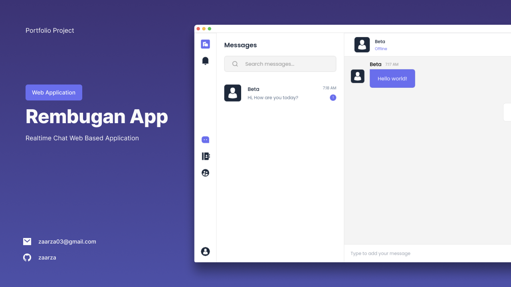
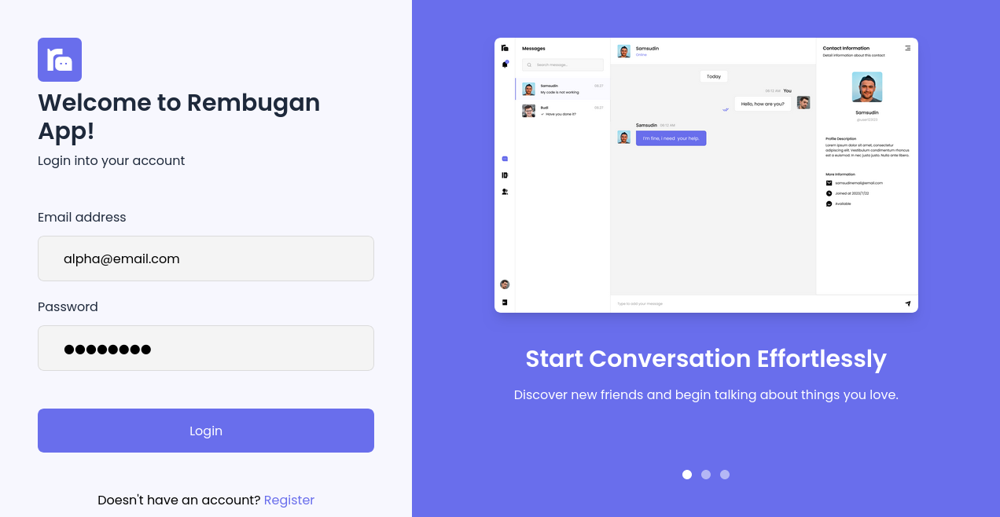
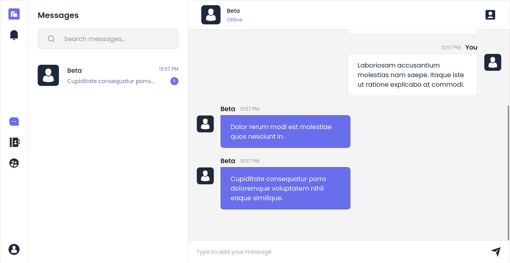
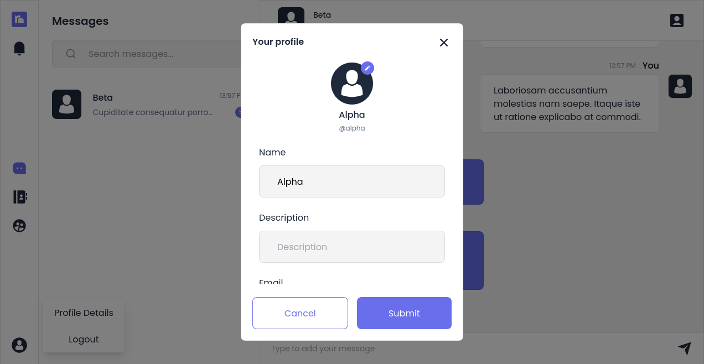
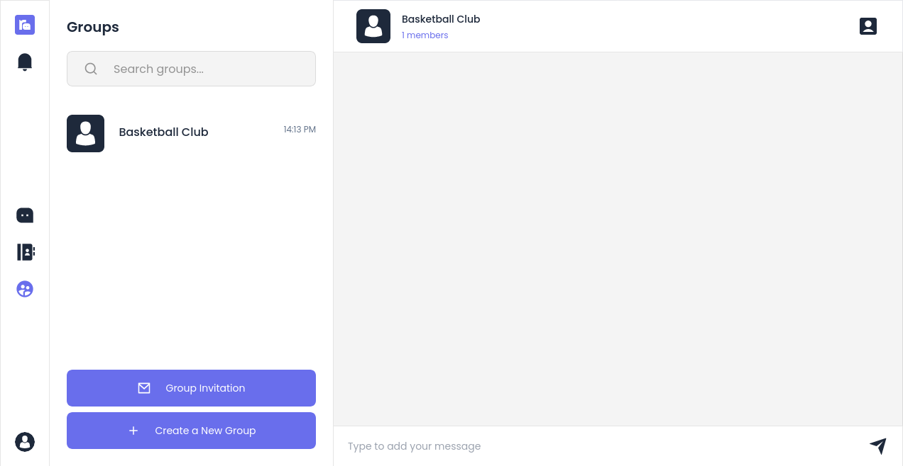
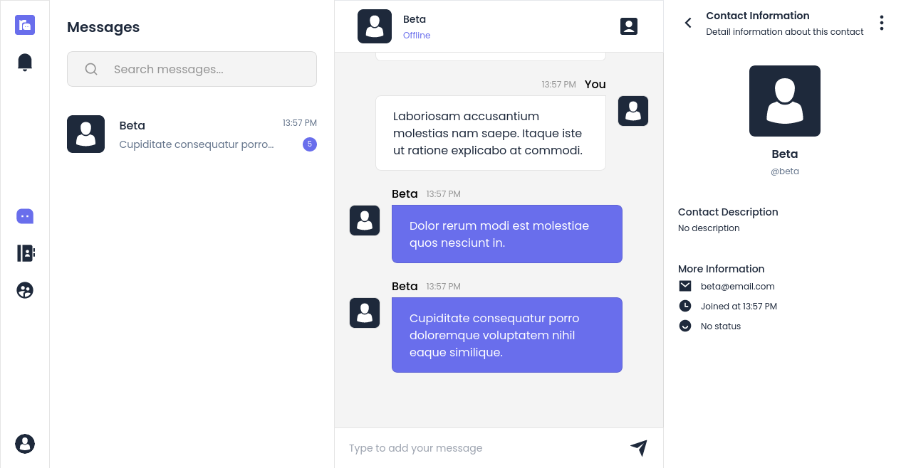
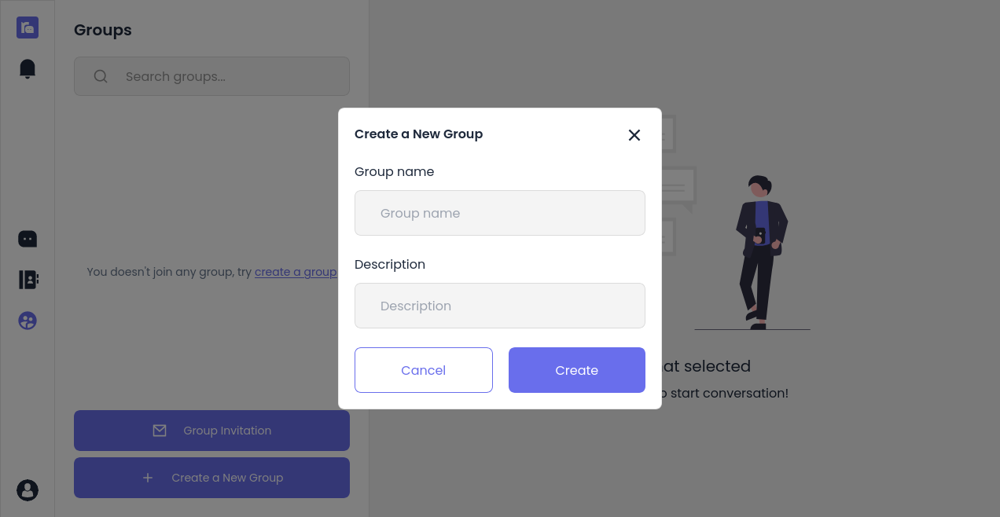

# Rembugan App - Realtime CHat Web Based Application

## About Tokoana

This is my first project which using websocket technology, i make many mistakes and learn many new things in this project. This project is not perfect, because you may encounter bugs while using it. Maybe I'll fix it another time

## Features

-   Realtime Chatting
-   Private & Group Conversation Type
-   Responsive in any screen devices

## Screenshots

## Library / Framework used

-   NextJS as main Javascript framework
-   Laravel as main PHP framework
-   Zustand for state management
-   Laravel Websockets as self hosted websocket
-   TailwindCSS
